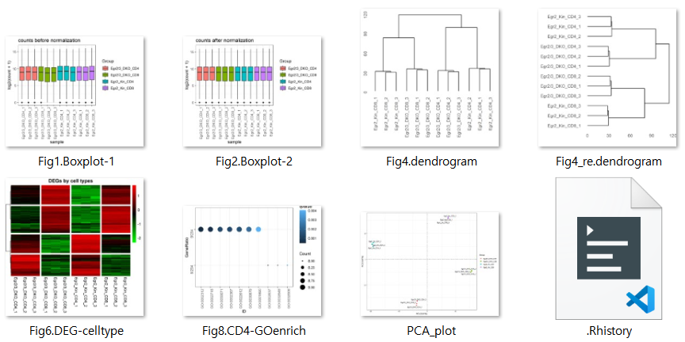
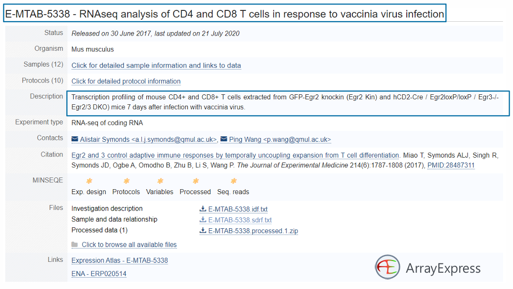
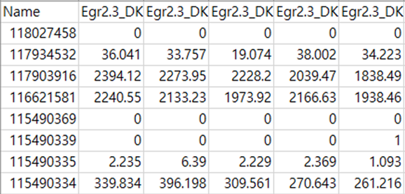

# EGR Knockin-Knockout RNA-seq Analysis
- 이 프로젝트는 EGR2/EGR3 넉인 및 넉아웃 마우스에서 CD4+/CD8+ T세포의 발현 전사체 데이터를 분석하는 코드입니다.

## 📂 폴더 구조
- `1_Preprocessing_Norm_TCC.R` : 데이터 전처리 및 정규화
    - data input, 발현된 마우스 유전자 필터링, 정규화(TCC), data melting, box plot
- `2_PCA_Dendrogram_Correlation.R` : PCA 및 덴드로그램 분석
    - PCA plot, dendrogram, expression correlation
- `3_DEG_Analysis_Heatmap.R` : 차등 발현 유전자(DEG) 분석
    - DEG by cell type / mutation 
- `4_Functional_analysis_EnrichGO.R` : 기능적 분석 (GO)
    - CD4 up/down, DKO up/down regulate 
- `EGR_Knockin_Knockout_RNAseq_full.R` : 위의 4개의 파일을 합한 full 파일
- `result_meaning.md` : 결과 해석
- `data/` : 원본 및 전처리된 데이터 저장
- `results/` : 분석 결과 저장
- `figures/` : 생성된 플롯 저장
- `more_study/` : 궁금한 내용 추가 공부
 

## 결과 미리보기

## 분석에 사용된 데이터
  
  

- ArrayExpress 사이트 DB에 저장된 E-MTAB-5338 데이터.
    - salmon, star, 보타이 등으로 예측한 발현치 데이터
    - 유전자 발현치를 나타내는 Count / TPM 데이터를 얻을 수 있음.
- metadata : 샘플그룹, 샘플 조건 등
- 유전자 주석 정보 : 유전자 기능 파악 또는 발현군간 기능 차이 비교분석

## 분석목적
이번 분석의 목적은 Egr2 Kin (knock-in)과 Egr2/3 DKO (knock-out) 마우스의 CD4+와 CD8+ T세포에서의 발현 차이를 비교하는 것입니다. 7일 후에 vaccinia virus로 감염된 마우스를 대상으로, Egr2의 발현 차이가 유전자 발현 및 세포 기능에 어떤 영향을 미치는지를 확인하려는 것입니다. 주요 목표는 Egr2와 Egr3의 기능이 마우스 T세포의 유전자 발현 패턴에 어떤 영향을 미치는지를 이해하는 것입니다.

### 1. Egr2 Kin (Knock-in)과 Egr2/3 DKO (Knock-out) 마우스 비교
- **Egr2 Kin 마우스**는 Egr2 유전자가 특정한 위치에 삽입된 변형된 마우스입니다. 이 마우스는 Egr2 유전자가 제대로 발현되어 있어, Egr2의 정상적인 기능이 이루어집니다.
- **Egr2/3 DKO (Double Knock-out) 마우스**는 Egr2와 Egr3 유전자 모두가 결실된 마우스입니다. 이 마우스에서는 Egr2와 Egr3의 기능이 모두 결손되었기 때문에, 이들의 발현 차이를 연구함으로써 Egr2와 Egr3의 유전자 발현 및 T세포 기능에 미치는 영향을 알 수 있습니다.
### 2. **CD4+와 CD8+ T세포 비교**
- **CD4+ T세포**와 **CD8+ T세포**는 서로 다른 면역 기능을 가지고 있습니다. CD4+ T세포는 주로 **조절 T세포**로서 면역 반응을 조절하고, CD8+ T세포는 **세포독성 T세포**로서 감염된 세포를 직접 공격합니다.
- 이 두 T세포 유형에서 **Egr2**와 **Egr3**의 발현 차이를 비교하는 것은, **이들 유전자가 각 T세포의 면역 기능에 어떻게 영향을 미치는지**를 알아보기 위한 중요한 단계입니다.
### 3. **Vaccinia virus로 감염된 마우스**
- **Vaccinia virus**는 **면역 반응을 유도하는 바이러스**로, 마우스에게 감염시켜 면역 반응을 자극하고 그에 대한 T세포 반응을 관찰합니다.
- **7일 후**는 보통 **면역 반응이 가장 활발하게 일어나는 시점**으로, T세포가 바이러스에 반응하여 활성화된 상태에서 유전자 발현 패턴의 변화를 살펴볼 수 있습니다.

## 분석 목표
- **Egr2 발현 차이가 유전자 발현에 미치는 영향**: Egr2가 발현되는 경우와 결손된 경우, T세포에서 발현되는 **다양한 유전자들이 어떻게 달라지는지**를 비교합니다. 예를 들어, Egr2가 T세포에서 중요한 면역 반응을 유도하는 데 중요한 역할을 한다면, **Egr2 Kin 마우스**에서 특정 유전자가 더 많이 발현될 수 있고, **Egr2/3 DKO 마우스**에서는 그 유전자들이 낮게 발현될 수 있습니다. 이를 통해 Egr2의 기능을 이해할 수 있습니다.
- **Egr2와 Egr3의 역할**: Egr2와 Egr3는 면역 세포에서 중요한 역할을 하는 **전사 인자**입니다. 이들이 각각 T세포에서 어떤 유전자 발현을 촉진하거나 억제하는지를 분석하여, **이들의 결손이 T세포의 기능에 미치는 영향**을 구체적으로 알아볼 수 있습니다.
- **면역 반응에서의 차이**: Egr2와 Egr3가 결손되었을 때, CD4+ T세포와 CD8+ T세포 각각의 발현 패턴이 어떻게 달라지는지 비교함으로써, **각 유전자가 면역 반응에서 차지하는 비중**을 평가할 수 있습니다. 예를 들어, Egr2가 결손된 마우스에서는 **면역 세포의 활성화**나 **사멸 조절이 달라질 수 있습니다.**
- 결과적으로, 각 분석 결과는 샘플 간 차이, 유전자 발현의 패턴, 그리고 기능적 해석을 제공하여, 넉인 및 넉아웃이 T세포의 유전자 발현에 미치는 영향을 명확하게 파악할 수 있도록 도와줍니다.

## 핵심 질문
- **Egr2와 Egr3**는 T세포에서 **어떤 유전자를 발현시키고 억제하는지?**
- 이들 유전자가 **면역 반응에 어떤 영향을 미치는지?**
- **Egr2 Kin과 Egr2/3 DKO 마우스에서의 발현 차이**는 **T세포의 면역 기능**에 어떻게 연결될 수 있는지?
- 이 분석을 통해 얻은 결과는 Egr2와 Egr3의 면역 기능에 대한 중요한 통찰을 제공하며, 향후 면역학적 연구나 치료법 개발에 기여할 수 있습니다.

## 분석 과정과 각 단계의 Input/Output
- **tcc 패키지 정규화 (Input: 유전자 발현치, Output: 정규화된 발현치)**
    - **목적**: 유전자 발현치가 샘플 간 비교가 가능하도록 정규화합니다. tcc는 **Transcript Count Correction**의 약자로, 샘플 간 기술적 차이를 보정하여 더 정확한 발현 분석을 할 수 있도록 도와줍니다.
    - **Input**: Count 또는 TPM 데이터
    - **Output**: 정규화된 발현치 (정규화된 count/TPM)
- **Box Plot (Input: 정규화된 발현치, Output: Box plot 그래프)**
    - **목적**: 유전자 발현 분포의 변동성을 시각적으로 파악합니다. 그룹 간 차이를 보여주고, 발현 수준이 고르게 분포하는지 확인할 수 있습니다.
    - **Input**: 정규화된 유전자 발현치
    - **Output**: 발현량 분포를 나타내는 박스 플롯
- **PCA (Principal Component Analysis) (Input: 정규화된 발현치, Output: PCA plot)**
    - **목적**: 데이터에서 주성분을 추출하여 샘플 간 차이를 시각화합니다. 이를 통해 샘플들이 어떻게 군집화되는지, 즉, 유전자 발현 패턴이 유사한 샘플들이 어떤 그룹을 형성하는지 알 수 있습니다.
    - **Input**: 정규화된 발현치
    - **Output**: PCA 그래프, 샘플 간의 군집 관계
- **Dendrogram (Input: 정규화된 발현치, Output: 덴드로그램)**
    - **목적**: 샘플들 간의 유사성 또는 차이를 나타내는 트리 형태로 시각화하여, 샘플 간 군집화 및 분류를 돕습니다.
    - **Input**: 정규화된 발현치
    - **Output**: 덴드로그램 그래프
- **Correlation Plot (Input: 정규화된 발현치, Output: 상관 행렬 플롯)**
    - **목적**: 서로 다른 유전자 간의 상관 관계를 시각화하여 유전자들 간에 어떤 연관성이 있는지 파악합니다.
    - **Input**: 정규화된 발현치
    - **Output**: 상관 행렬 플롯
- **DEG Heatmap (Differentially Expressed Genes Heatmap) (Input: 정규화된 발현치, Output: DEG Heatmap)**
    - **목적**: 차등 발현 유전자(DEGs)를 확인하고, 그들의 발현 패턴을 시각적으로 분석하여 두 그룹 간 발현 차이를 알아봅니다.
    - **Input**: 정규화된 발현치
    - **Output**: DEG 히트맵 (차등 발현 유전자의 발현 패턴)
- **Functional Analysis with enrichGO (Input: DEG 리스트, Output: GO 분석 결과 플롯)**
    - **목적**: DEG에 대해 **Gene Ontology (GO)** 분석을 수행하여, 어떤 생물학적 과정, 세포 구성 요소, 분자 기능 등이 차등 발현된 유전자와 관련이 있는지를 파악합니다.
    - **Input**: DEG 목록
    - **Output**: GO 분석 결과 플롯 (차등 발현 유전자에 대한 기능적 해석)

