# 결과 해석

## 발현된 마우스 유전자 필터링
- 전체 샘플의 75% 이상인 9샘플에서, 
- 각 유전자의 read count가 5 이상인 유전자를 발현된 유전자로 정의하고, 
- 불필요한 noise를 제거하여 총 24453개의 유전자에서, 13503개의 유전자를 발현된 유전자로 선별


## Box plot
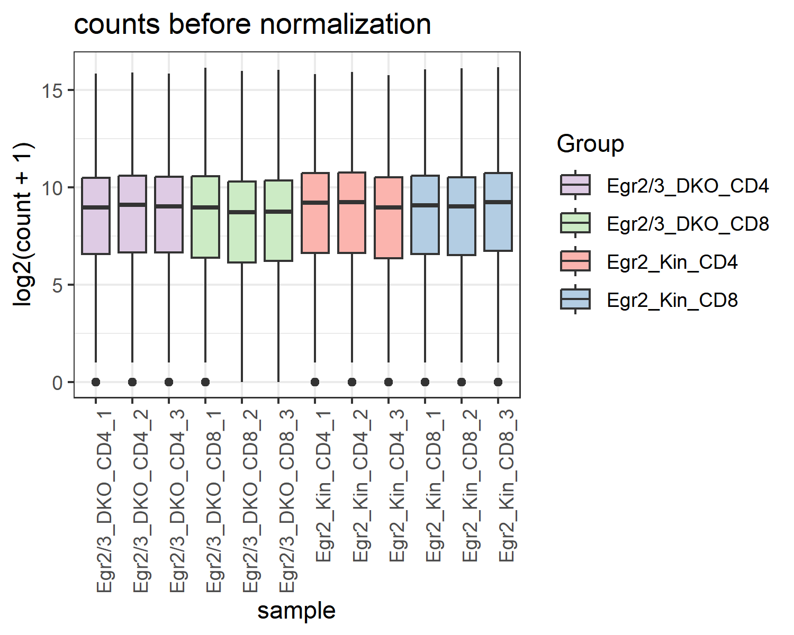
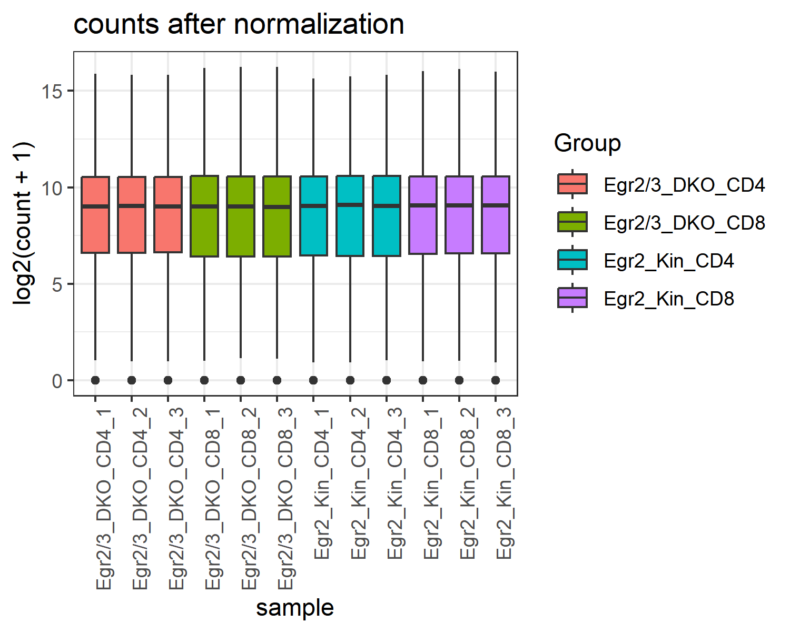
- ggplot2 패키지를 사용하여 box plot을 그렸고, 
- 정규화를 통해 실험 차이가 최소화된 것을 발현분포를 통해 확인할 수 있다. 
- RNA-Seq 데이터의 정규화는 필수적인 단계로, 샘플 간 라이브러리 크기와 발현 값의 분포 차이를 보정하여 신뢰성 높은 생물학적 해석과 통계적 유효성을 확보하는 데 기여한다.

## PCA plot
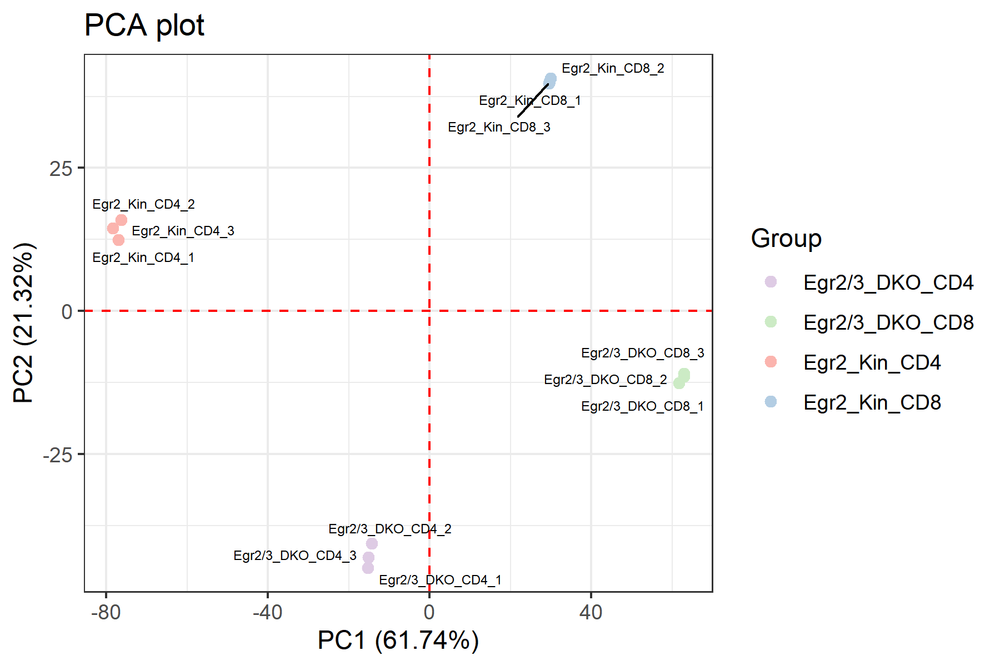

- PCA 분석 결과를 시각화하여, 샘플 간의 변동성과 주요 샘플 간의 패턴을 파악하고, 그룹별, 또는 조건별로 색상과 모양을 구분함.
- PC1 (61.74%): T세포 유형(CD4+ vs CD8+)에 따라 샘플들이 구분됩니다. CD4+ T세포와 CD8+ T세포는 발현 패턴에서 차이를 보인다.
- PC2 (21.32%): Egr2와 Egr3 유전자 결손에 따라 샘플들이 구분된다.
- 결론: T세포 유형(CD4+ vs CD8+)의 차이가 유전자 결손(Egr2 Kin vs DKO)에 비해 유전자 발현 패턴에 더 큰 영향을 미친다는 것을 확인할 수 있다.

### 더 자세히
### 1. **CD4+와 CD8+의 구분** (PC1을 따라)
- PC1 (x축)은 **CD4+ T세포**와 **CD8+ T세포**를 구분하는 축입니다.
- **CD8+ T세포** (파란색)는 **x축의 양수 쪽**에 분포하고, **CD4+ T세포** (빨간색)는 **x축의 음수 쪽**에 위치합니다.
    - **CD4+ T세포**와 **CD8+ T세포**는 서로 다른 면역 기능을 가지며, PCA 분석을 통해 유전자 발현 패턴에서 차이를 보이는 것으로 해석됩니다.
    - **CD8+ T세포**는 **세포독성 T세포**로 감염된 세포를 공격하고, **CD4+ T세포**는 **조절 T세포**로 면역 반응을 조절합니다. 이들의 발현 패턴은 서로 다르기 때문에 PC1에서 분리됩니다.

### 2. **Egr2 Kin과 Egr2/3 DKO 그룹의 구분** (PC2를 따라)
- PC2 (y축)는 **Egr2 Kin**과 **Egr2/3 DKO** 그룹을 구분하는 축입니다.
- **Egr2 Kin** 그룹은 **y축의 양수 쪽**에 위치하고, **Egr2/3 DKO** 그룹은 **y축의 음수 쪽**에 위치합니다.
    - **Egr2 Kin**은 **Egr2** 유전자가 **정상적으로 발현**되는 그룹이고, **Egr2/3 DKO**는 **Egr2와 Egr3 유전자**가 **결손된** 그룹입니다. 이 두 그룹은 유전자 발현 패턴에서 큰 차이를 보이며, 이는 **Egr2와 Egr3 유전자 결손**이 T세포의 발현 패턴에 영향을 미친다는 것을 나타냅니다.

### 3. **PC1과 PC2를 통한 분석 결과**
- **PC1**에서 **CD4+ T세포와 CD8+ T세포**가 구분되는 것으로 보이는데, 이는 **셀 타입**에 따라 **발현 패턴**이 달라서 나타나는 결과입니다.
- **PC2**에서 **Egr2 Kin과 Egr2/3 DKO**가 구분되는 것은 **Egr2와 Egr3 유전자 결손**이 T세포의 유전자 발현에 중요한 영향을 미친다는 것을 의미합니다.

### 4. **셀타입 영향이 넉인 넉아웃보다 더 크다는 해석**
- **PC1**이 **CD4+와 CD8+ T세포**의 구분을 잘 설명하고, **PC2**가 **Egr2 Kin**과 **Egr2/3 DKO** 그룹을 구분한다는 사실은 **셀 타입의 차이가 유전자 발현 패턴에 더 큰 영향을 미친다**는 해석을 가능하게 합니다.
    - **PC1**의 **설명력**이 **61.74%**로 **PC2** (21.32%)에 비해 훨씬 크기 때문에, **T세포 유형**에 따른 차이가 **Egr2와 Egr3의 결손**보다 **훨씬 더 큰 영향을 미친다고 볼 수 있습니다**.
    - 예를 들어, **Egr2 Kin**과 **Egr2/3 DKO** 간의 차이는 **PC2**에서만 주로 나타나고, **PC1**에서는 크게 구분되지 않으므로, **T세포의 유형**이 유전자 결손보다 **발현 패턴에 더 큰 영향을 미친다고 결론지을 수 있습니다**.

## dendrogram
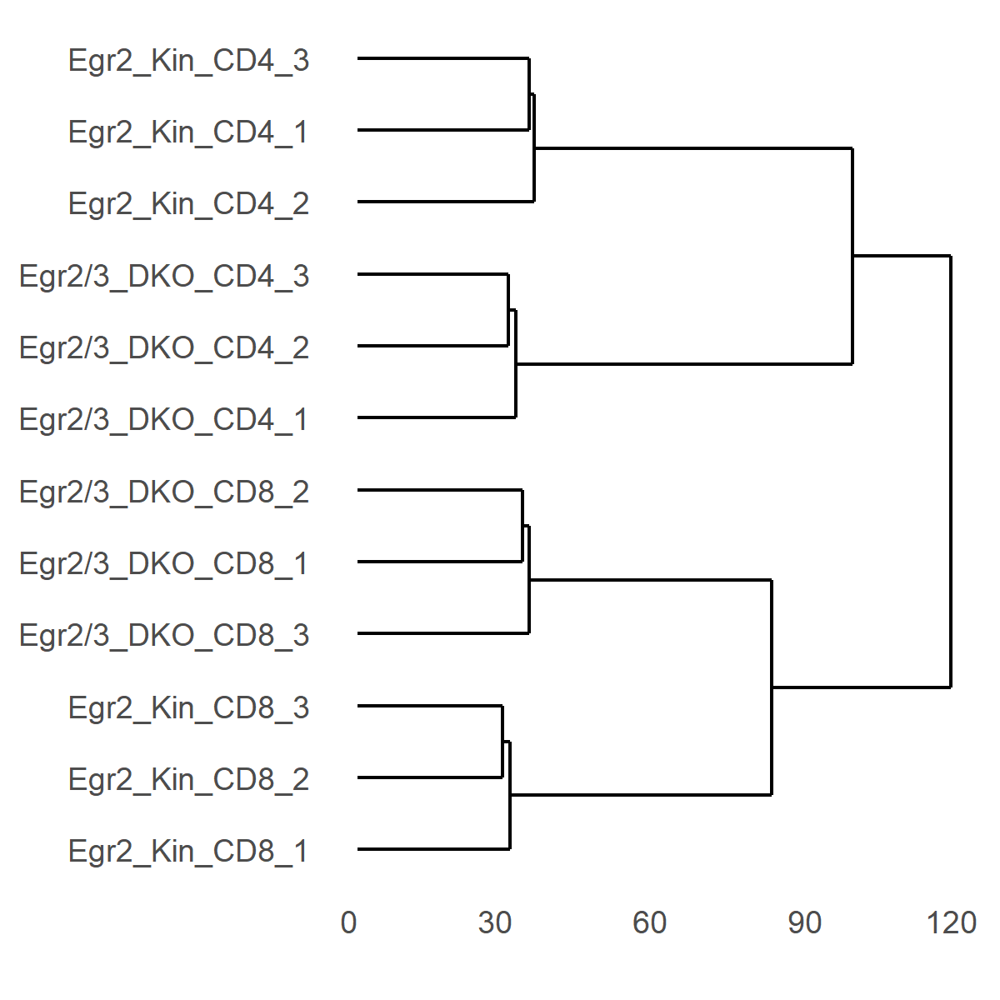

### Dendrogram에서 보이는 경향성 분석
1. 조건별로 반복값들이 잘 군집화됨
    - 같은 조건의 샘플들이 잘 모여 클러스터를 형성함
    - Egr2_Kin_CD4 조건의 샘플들이 서로 가깝게 군집화 됨
2. 셀 타입 (CD4 vs CD8)에 따른 분리
    - CD4+ T세포와 CD8+ T세포는 서로 다른 군집으로 잘 구분되는 경향
    - Egr2_Kin_CD4와 Egr2/3_DKO_CD4는 한 군집을 이루고, Egr2_Kin_CD8과 Egr2/3_DKO_CD8는 다른 군집

### PCA plot vs Dendrogram
- PCA plot
    - 주성분 분석을 통해 샘플 간 관계를 평가
    - input data : 주성분 분석 결과
- dendrogram
    - clustering을 기반으로 조건 간의 유사도를 계산
    - input data : 유전자 발현 데이터, 거리행렬
→ PCA plot과 dendrogram 둘다 사용해서 조건 간의 경향성 분석을 교차검증을 할 수 있다.


## correlation 상관관계 분석
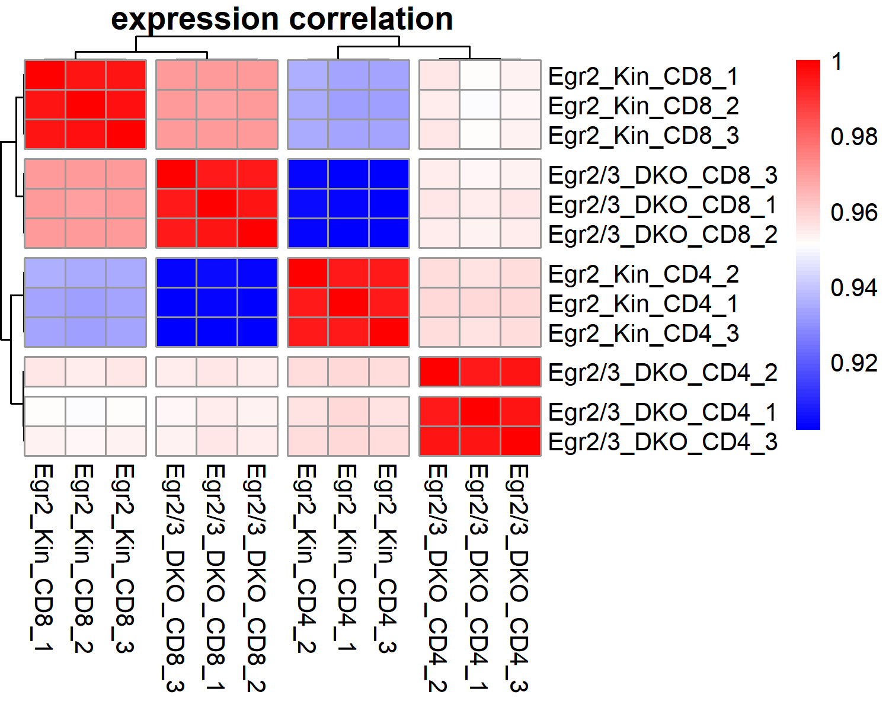

### cor(log2DF)
- 유전자 발현 데이터의 상관관계를 계산
- input 되는 log2DF : 상관관계는 각 샘플 간의 유사성을 나타냄
- 상관계수 : -1에서 1까지의 값을 가지며, 1에 가까울수록 두 샘플 간의 발현 패턴이 매우 유사하다는 의미

### heat map 결과
- CD8 샘플들 간 상관관계가 더 가까움
    - CD8 샘플들 간에 상관관계가 높고 빨간색이 많이 보임
    - =CD8+ T세포의 샘플들이 서로 비슷한 발현 패턴을 보임

- CD8 넉아웃과 CD4 넉인
    - 파란색이 보이는 부분은 이 두 그룹이 상관관계가 낮고 발현 차이가 크다는 것을 의미
    - = 넉인(Egr2 Kin)과 넉아웃(Egr2/3 DKO)에 의한 차이가 생물학적으로 더 큰 영향을 미침


## DEGs by Cell Type


### 차등발현유전자
- 로그2 폴드 변화 (m.value)가 2 이상이고, 
- FDR (False Discovery Rate) 값이 0.05 이하인 유전자들로 선택됨
- 이 기준을 통해 CD4+와 CD8+ T세포 간의 발현 차이가 유의미한 유전자들을 추출
- 574개의 DEG가 확인되었으며, 이 유전자들은 CD4+와 CD8+ 세포 타입의 발현 차이를 나타내는 유전자들임.
- DEG 히트맵 : 유전자 간 발현 패턴을 색상으로 나타냄

### DEG 히트맵 
- 스케일링을 통해 각 유전자의 발현 값을 평균 0, 표준편차 1로 변환하여 차이를 직관적으로 비교할 수 있도록 만듦.
- CD4+와 CD8+ T세포 간의 발현 차이를 명확하게 보여주는 히트맵 (셀 타입에 따른 발현 패턴 차이가 잘 드러남)
- 같은 셀 타입(CD4+ 또는 CD8+) 내에서는 유사한 발현 패턴을 보이고, CD4+와 CD8+ 간에는 뚜렷한 발현 차이가 존재함!

## DEGs by Mutation Type


### mutTCC
- mutation 타입(넉인, 넉아웃)에 따라 샘플들을 그룹화
- TMM 정규화 방법을 사용하여 발현값을 정규화
- edgeR을 이용해 DEG를 계산

### 차등발현유전자
- 로그2 폴드 변화 (m.value)가 2 이상이고, 
- FDR (False Discovery Rate) 값이 0.05 이하인 유전자들로 선택됨

### 색깔
- 초록색: 발현 패턴이 낮거나 발현 차이가 적은 유전자
- 빨간색: 발현 패턴이 높거나 유의미하게 발현된 유전자

### 해석
- cutree_rows = 2 : 유전자들을 2개의 군집으로 나누어 발현 패턴이 유사한 유전자들끼리 묶여서 시각화
1. Egr2 Kin 그룹 : 넉인된 유전자들이 발현이 높고, 
2. Egr2/3 DKO : 넉아웃에 의해 발현이 낮은 유전자들을 나타냄
- mutation type에 따라 cell type(CD4 vs CD8) 내에서도 발현 패턴이 달라지는 생물학적 차이가 존재함을 확인

## GOenrich

### 주의사항 : functional enrichment 하기전에 확인할 것
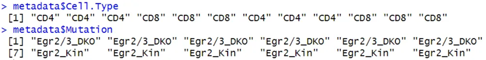 <br>

- CD4와 넉아웃이 1 (=컨트롤 그룹)로 설정되고
- CD8과 넉인이 2 (=케이스 그룹)로 설정되었다는 것 확인 <br>

- metadata를 factor로 변환한 결과, 1이 컨트롤 그룹이고, 2가 케이스 그룹이기 때문에, 
- logFC가 양수이면 케이스인 CD8/넉인에서 발현이 증가한 거고, 
- logFC가 음수이면 CD4/넉아웃에서 발현이 증가한 것 <br>

- 참고로 log2FC는 컨트롤 대비 케이스에서 발현이 높은것을 의미한다.

### 로그2 폴드 변화 (Log Fold Change, logFC)
- 먼저, **로그2 폴드 변화(logFC)**에 대해 이해할 필요가 있어요. **로그2 폴드 변화**는 두 그룹 간의 발현 차이를 비교하는 **수치적 지표**입니다.
    - **logFC > 0**: 케이스 그룹에서 발현이 **증가**한 유전자
    - **logFC < 0**: 케이스 그룹에서 발현이 **감소**한 유전자
- **로그2**라는 걸 사용하는 이유는, **발현의 변화를 비율로 나타내기 위해**서입니다. 예를 들어:
    - **logFC = 1**이면 **2배** 차이 (즉, 케이스에서 발현이 2배 증가)
    - **logFC = -1**이면 **2배 감소** (즉, 케이스에서 발현이 절반으로 감소)
- 따라서, **logFC 절댓값**이 커지면 유전자 발현 차이가 더 커졌다고 할 수 있어요.

### 왜 m.value가 -2 이하???
```
CD4_up = as.numeric(cellTCC$gene_id[cellTCC$m.value <= -2 & cellTCC$q.value <= 0.05])
```
- 여기에서 `m.value`는 **로그2 폴드 변화**(`logFC`) 값이에요. `m.value <= -2`는 **로그2 폴드 변화 값이 -2 이하인 유전자**들을 선택한다는 뜻이에요.
- **m.value <= -2**: 이는 **CD4에서 발현이 증가**한 유전자들만 뽑겠다는 의미입니다.
    - `m.value = -2`는 **발현 차이가 4배 이상** (즉, CD4에서 발현이 4배 이상 증가한 유전자들)이라는 의미죠.
- **왜 -2 이하일까요?**
    - **2**를 기준으로 하는 이유는 **발현 차이가 상당히 크고 유의미한 유전자들**만 뽑기 위해서입니다. 즉, **CD4에서 발현이 4배 이상 증가한 유전자들**을 확인하려는 거죠.


### GOenrichment에서 사용되는 함수
**enrichGO()** <br>
- CD4에서 발현이 증가한 유전자들에 대해 Gene Ontology (GO) enrichment 분석을 수행
- → 유전자들의 기능적 분류(예: 생물학적 과정, 분자 기능 등)를 통해 어떤 생리학적 과정과 관련이 있는지를 평가

**CD4_up** <br>
- 로그2 폴드 변화가 -2 이하인 유전자들이 저장됨
- CD4 세포에서 발현이 증가한 유전자들을 의미

**CD4_enrich** <br>
- q value <= 0.05를 기준으로 유의미한 결과만을 선택
- 유전자 수(Count)가 많은 순서대로 정렬
- → 중요 GO 항목을 도출


## GOenrich - CD4 up regulate
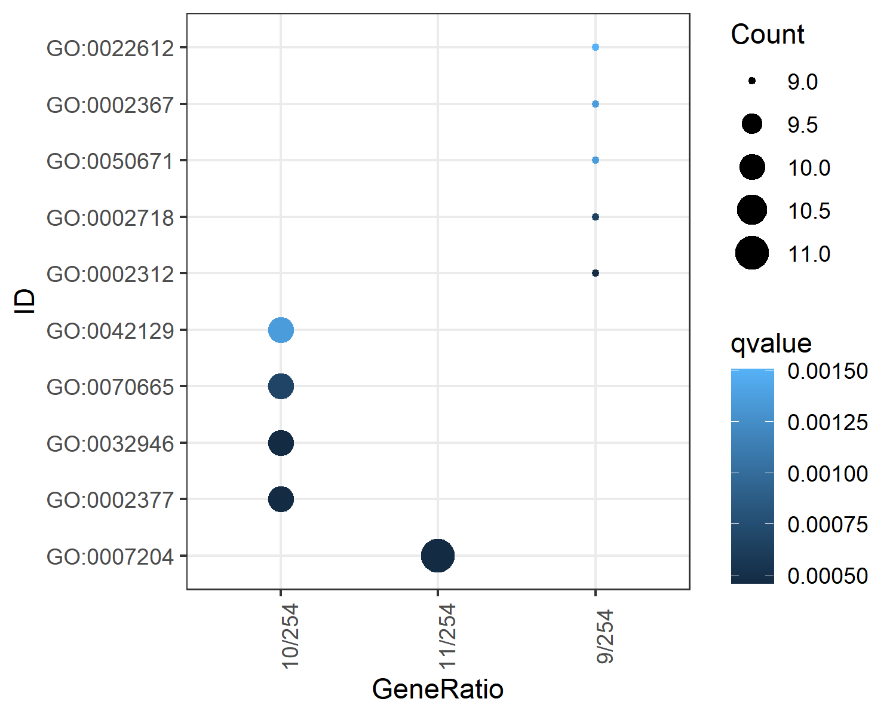 <br>

- x축
    - 254개 중, 10개가 enrich됨
    - 254개 중, 11개가 enrich됨
    - 254개 중, 9개가 enrich됨
- CD4에서 발현이 유의미하게 증가한 GO
- = CD8에서 발현이 유의미하게 감소한 GO
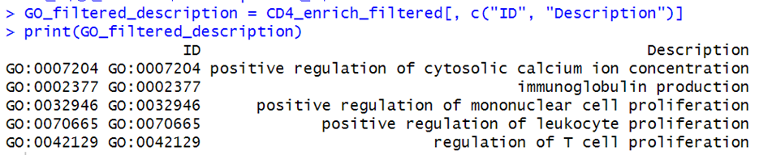 <br>

## GOenrich - CD4 down regulate
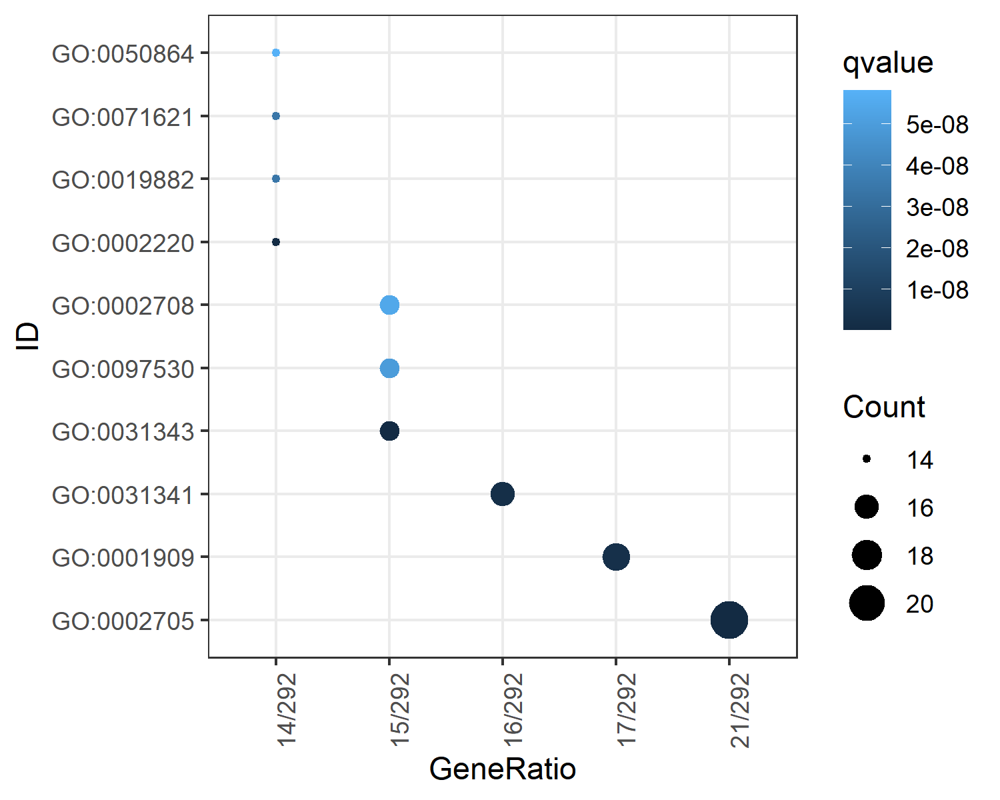 <br>

- CD4에서 발현이 유의미하게 감소한 GO
- = CD8에서 발현이 유의미하게 증가한 GO
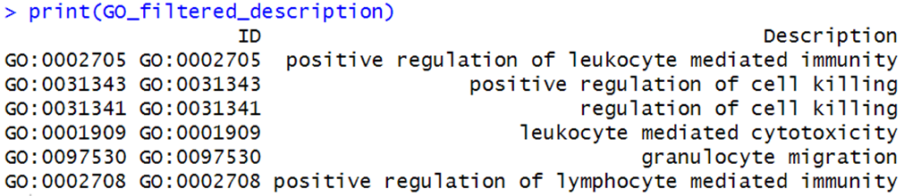 <br>

## GOenrich - DKO up regulate
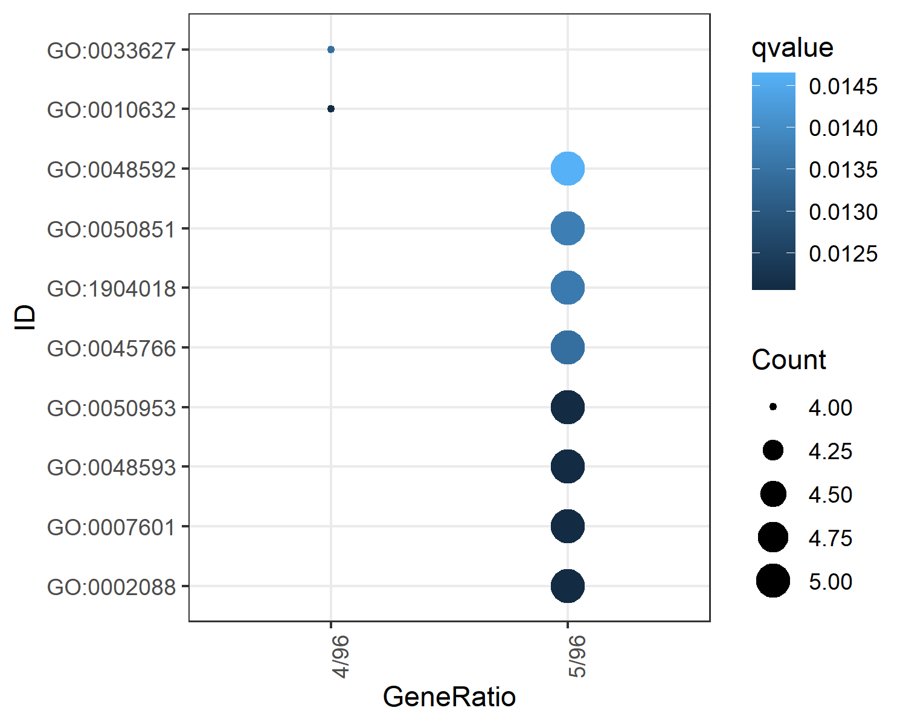 <br>
넉아웃일 때 발현이 증가한 유전자들 중 유의미하게 발현된 GO <br>

- 넉아웃일 때 발현이 유의미하게 증가한 GO
- =넉인일 때 발현이 유의미하게 감소한 GO
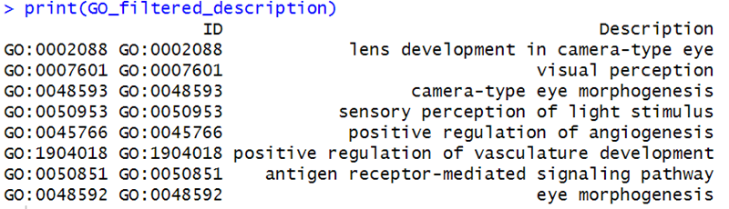 <br>


## GOenrich - DKO down regulate
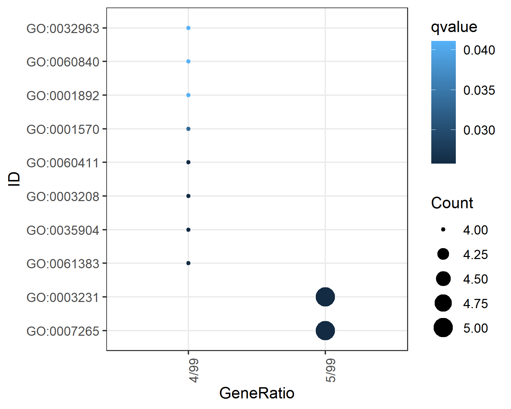 <br>
넉아웃일 때 발현이 감소한 유전자들 중 유의미하게 발현된 GO  <br>

- 넉아웃일 때 발현이 유의미하게 감소한 GO
- = 넉인일 때 발현이 유의미하게 증가한 GO
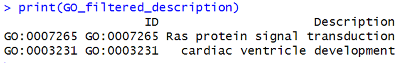 <br>


